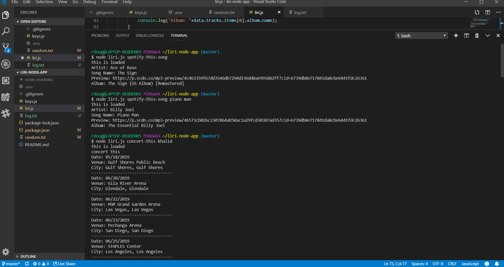
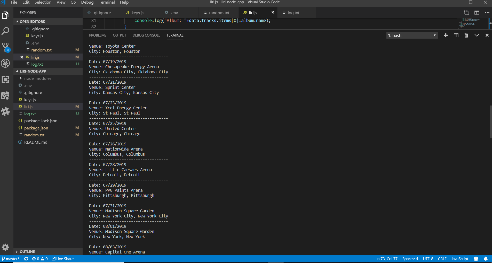
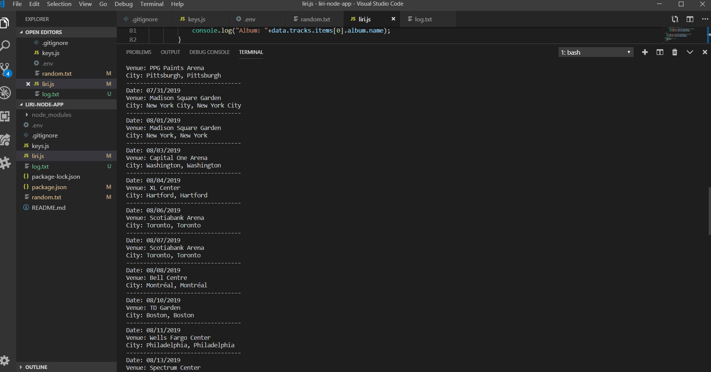
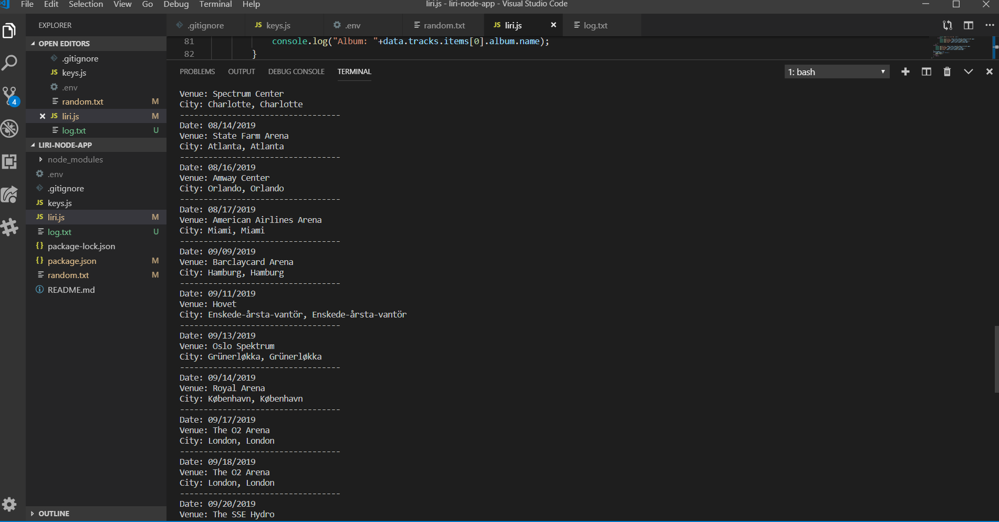
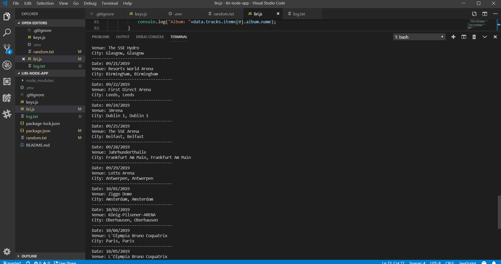

# liri-node-app
In this back-end application, the user is able to call the following commands: 
    -spotify-this-song
    -movie-this
    -concert-this
    -do-what-it-says
using the Spotify API, OMDB API, and Bands In Town API. In order to use the app, the user must install axios along with these APIs (require registration with the APIs & keys).

When spotify-this-song is called followed by the name of a song, a call is made to the Spotify API after which the following information is displayed on the console:
    -The artist of the song's name
    -The song's name
    -A preview link of the song on Spotify
    -The album the song came from
If no song is called after "spotify-this-song", the song will default to "The Sign" by Ace of Base.

When movie-this is called followed by the name of a movie, a call is made to the OMDB API after which the following information is displayed on the console:
    -The title of the movie
    -Year the movie came out
    -IMDB rating of the movie
    -Rotten Tomatoes rating of the movie
    -Country where the movie was produced
    -Language of the movie
    -Plot of the movie
    -Actors in the movie
If no movie is called after "movie-this", the movie will default to "Mr. Nobody".

When concert-this is called followed by the name of an artist, a call is made to the Bands In Town API after which the following information is displayed on the console for each future concert of the artist:
    -Name of the venue
    -Venue location
    -Date of the event in MM/DD/YYYY form

When do-what-it-says is called, the text file, random.txt, is read and executes the commands given in the text of the file one at a time. 

Below are images of each command being executed.

